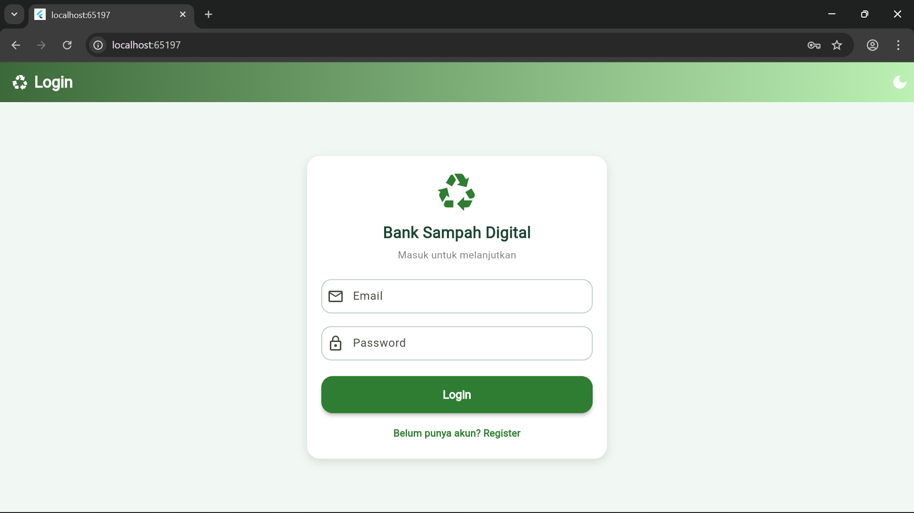
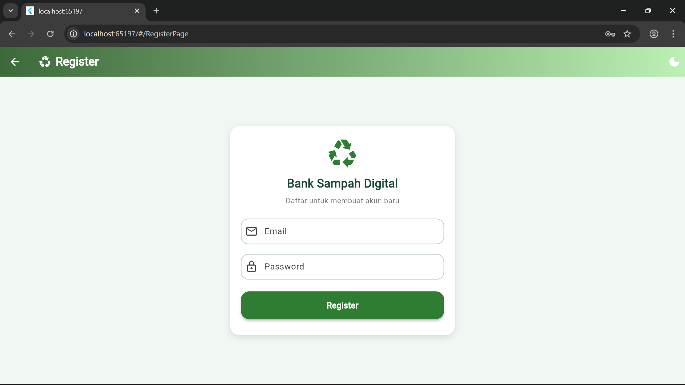

# APLIKASI BANK SAMPAH DIGITAL

## Deskripsi Aplikasi
Aplikasi Bank Sampah Digital adalah aplikasi mobile berbasis Flutter yang digunakan untuk mencatat setoran sampah secara digital. Aplikasi ini memungkinkan pengguna untuk menambahkan, melihat, mengubah, dan menghapus data setoran sampah. Setiap data setoran terdiri dari nama penyetor, jenis sampah, dan berat sampah dalam satuan kilogram. Aplikasi ini membantu proses pencatatan menjadi lebih rapi, terstruktur, dan mudah dikelola.

Pada pengembangan lanjutan aplikasi ini, sistem telah terintegrasi dengan Supabase sebagai backend database dan autentikasi pengguna. Pengguna diwajibkan melakukan registrasi dan login sebelum dapat mengakses aplikasi.

Selain itu, aplikasi juga telah dilengkapi dengan fitur Light Mode dan Dark Mode yang memungkinkan pengguna menyesuaikan tampilan aplikasi agar lebih nyaman digunakan pada berbagai kondisi pencahayaan.

## Struktur Folder Inti
```
lib/
├─ main.dart
├─ controllers/
│ └─ theme_controller.dart
└─ pages/
├─ login_page.dart
├─ register_page.dart
├─ home_page.dart
└─ form_page.dart
```

## Fitur Aplikasi

### 1. Create (Tambah Data)
Pengguna dapat menambahkan data setoran sampah dengan mengisi form input yang terdiri dari nama penyetor, jenis sampah, dan berat sampah.

### 2. Read (Tampilkan Data)
Aplikasi menampilkan daftar seluruh data setoran yang telah dimasukkan beserta total jumlah setoran dan total berat sampah.

### 3. Update (Edit Data)
Pengguna dapat mengubah data setoran yang telah tersimpan melalui halaman form edit.

### 4. Delete (Hapus Data)
Pengguna dapat menghapus data setoran dari daftar yang tersedia.

### 5. Multi Page Navigation
Aplikasi memiliki beberapa halaman, yaitu:

- Halaman Utama (Daftar Setoran)
- Halaman Tambah Setoran
- Halaman Edit Setoran
- Halaman Login
- Halaman Register

### 6. Autentikasi Pengguna
Aplikasi menggunakan Supabase Auth untuk sistem autentikasi pengguna.  
Pengguna harus melakukan registrasi dan login sebelum dapat mengakses aplikasi.

### 7. Light Mode dan Dark Mode
Aplikasi menyediakan pilihan **mode terang (Light Mode)** dan **mode gelap (Dark Mode)** yang dapat diubah melalui tombol pada AppBar untuk meningkatkan kenyamanan pengguna saat menggunakan aplikasi.

## Widget yang Digunakan

- **GetMaterialApp**  
  Digunakan sebagai widget utama untuk mengatur konfigurasi aplikasi serta mendukung sistem navigasi menggunakan GetX.

- **Scaffold**  
  Digunakan sebagai struktur dasar halaman yang menampung AppBar, body, dan FloatingActionButton.

- **AppBar**  
  Digunakan untuk menampilkan judul dan bagian header pada setiap halaman aplikasi.

- **Column**  
  Digunakan untuk menyusun beberapa widget secara vertikal dari atas ke bawah.

- **Row**  
  Digunakan untuk menyusun beberapa widget secara horizontal dalam satu baris.

- **Expanded**  
  Digunakan untuk mengatur pembagian ruang agar widget dapat mengisi sisa ruang yang tersedia.

- **Container**  
  Digunakan untuk mengatur ukuran, padding, warna, dan dekorasi suatu komponen tampilan.

- **ListView**  
  Digunakan untuk menampilkan daftar data dalam bentuk list yang dapat digulir.

- **Card**  
  Digunakan untuk menampilkan data dalam bentuk kartu agar tampilan lebih rapi dan terstruktur.

- **ListTile**  
  Digunakan untuk menampilkan satu item data dalam bentuk baris di dalam ListView.

- **TextField**  
  Digunakan untuk menerima input data dari pengguna.

- **DropdownButtonFormField**  
  Digunakan untuk memilih jenis sampah dari beberapa pilihan yang tersedia.

- **ElevatedButton**  
  Digunakan sebagai tombol untuk menjalankan aksi seperti menyimpan data atau melakukan login dan register.

- **FloatingActionButton**  
  Digunakan sebagai tombol utama untuk menambahkan data baru.

- **IconButton**  
  Digunakan sebagai tombol berbentuk ikon untuk aksi seperti edit, hapus, dan mengganti tema.

- **SizedBox**  
  Digunakan untuk memberikan jarak atau mengatur ukuran tertentu pada layout.

- **AlertDialog**  
  Digunakan untuk menampilkan konfirmasi aksi seperti logout atau menghapus data.

- **Get.snackbar**  
  Digunakan untuk menampilkan notifikasi atau pesan informasi kepada pengguna.

- **Navigator**  
  Digunakan untuk mengatur perpindahan halaman dalam aplikasi seperti dari login ke halaman utama atau ke halaman form.

## Screenshot Nilai Tambah
1. Halaman Login
#### 
2. Halaman Register
#### 

  
